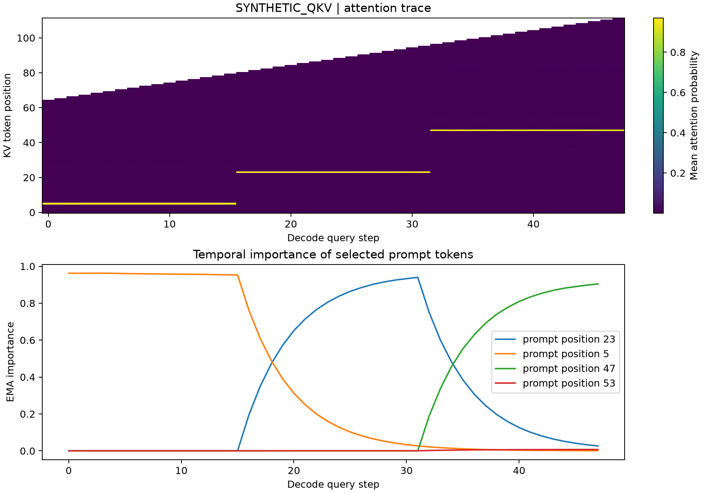

# KV Cache Temporal Importance Lab

研究自回归解码过程中 token 的注意力贡献变化，并用离线量化实验比较不同历史分数的保护策略。作者：赵志豪。项目在 AI 辅助下整理与实现，公式、测试与适用边界在仓库中明确记录。

**当前可复现结果为模拟 Q/K/V；真实 Qwen3-1.7B 权重实验尚未运行。** 已提供真实模型采集入口，并使用小型随机初始化 Qwen3 验证缓存递增流程。项目不是 PagedAttention、KIVI 或 KVQuant 的完整复现，也没有实现部署级压缩缓存或 CUDA 内核。



## 1. 快速运行

建议 Python 3.12，Windows PowerShell 在项目目录执行：

```powershell
py -3.12 -m venv .venv
.\.venv\Scripts\python.exe -m pip install -r requirements.txt
.\.venv\Scripts\python.exe -m pytest -q
.\.venv\Scripts\python.exe -m kv_lab.demo --seed 42 --steps 48 --out runs/demo
```

没有 Python 3.12 时，先从 [Python 官网](https://www.python.org/downloads/) 安装；模拟模式也支持较新的 Python。Linux/macOS 将 `.venv\Scripts\python.exe` 替换成 `.venv/bin/python`。无需 API Key，无需下载模型，无需显卡。不要直接运行单个包内文件，应使用 `python -m kv_lab.demo`。

更换平滑参数进行消融：

```powershell
.\.venv\Scripts\python.exe -m kv_lab.demo --seed 42 --alpha 0.1 --window 16 --out runs/alpha01_window16
```

## 2. 研究问题与实验流程

关注的问题是：一个当前重要的 KV token，未来是否仍重要？使用累计注意力可能偏向较早出现的 token；窗口分数可以忘记旧信息；指数平滑可以在稳定性与响应速度之间调整。

流程为 `构造 Q/K/V → 完整注意力参考 → 历史分数更新 → 下一步保护决策 → 量化反量化 → 重算当前注意力输出 → 导出对照结果`。模拟输入包括长期较大的 Key 通道、分散的 Value 离群值，以及分三阶段切换的查询锚点。默认使用 seed=42、64 个 prompt token、48 次解码查询、2 个头、每头 32 维。这是人为构造的机制测试，不能证明真实模型中的策略收益。

## 3. token 重要性定义

对于第 s 次解码查询，先计算 `A_s = softmax(Q_s K_s^T / sqrt(D))`，再对选定层和查询头求均值得到每个 KV 位置的注意力概率 `a[s,t]`。这是一种**注意力贡献代理指标**，不等于删除该 token 后的因果影响。真实模型默认仅采集最后一层，可以通过 `--layers` 改变。

| 分数 | 定义 | 适用性与局限 |
|---|---|---|
| instant | 当前查询对位置 t 的平均注意力 | 响应快，波动也大 |
| cumulative | 自 token 可见以来的注意力求和 | 保留长期贡献，但受 token 年龄影响 |
| window | 最近 W 次可见观测的均值 | 对阶段切换响应快，窗口长度影响稳定性 |
| ema | `alpha*a[s,t]+(1-alpha)*ema[s-1,t]` | 平滑参数控制记忆长度；首个观测直接初始化 |

未出现的 token 使用 NaN，避免把出生前的不存在记录当成零分；窗口分数按实际可见次数除，不稀释新 token。排名变化仅在固定 prompt token 集合上计算 Top-8 集合 Jaccard，避免生成位置增加改变候选集合。逻辑块分数是连续 16 个 KV 位置的注意力之和，供观察聚集趋势。

## 4. 量化与保护策略

采用分组 affine min-max 量化：`scale=(max-min)/(2^b-1)`，`code=clip(round((x-min)/scale))`，随后反量化。常量组直接保留其常数。

* Key 按通道量化：固定头、通道，在时间维上按 16 个 token 分组。
* Value 按 token 量化：固定头、token，在通道维上按 16 个元素分组。
* 每个配置保留最近 8 个 token 为全精度；累计、窗口、EMA、随机策略另外保护 8 个旧 token。保护位置在估计组范围之前排除，避免其离群值污染量化尺度。
* 重要性选择仅使用**前一解码步骤**的分数，不读取当前查询的注意力来决定当前保护集合。随机对照使用固定种子。首步没有历史分数，汇总时排除该步。
* `ema_outliers` 额外保留每组绝对值最大的元素。目标比例为 2%，实际按组向上取整，短组比例可能更高；这是稀疏离群值保留的教学对照。

比较 cumulative/window/ema/random 时，全精度 token 预算一致。recent-only 只保护 8 个位置，不能用它与 16 个位置策略的差异证明分数机制优越。EMA+outliers 额外消耗稀疏存储，不能视为等存储预算对照。

## 5. 输出和已验证结果

| 文件 | 用途 |
|---|---|
| attention_trace.npz | 注意力矩阵及 prompt 长度，NaN 表示当时尚不可见 |
| token_scores.csv | 解码步骤、token 位置、四类重要性分数 |
| rank_dynamics.csv | 固定 prompt 集合上的排名集合变化 |
| logical_blocks.csv | 16-token 逻辑块的注意力质量之和 |
| quantization.csv | 每步骤、位宽、保护策略的 K/V MSE 与输出相对误差 |
| summary.csv | 排除首步后的策略均值 |
| metadata.json | 来源、随机种子、环境、分数定义及参数 |
| importance.png | 注意力热图与代表性 token 的 EMA 曲线 |

输出误差定义为 `||O_quant-O_full||_2 / max(||O_full||_2,1e-12)`，其中 O 是注意力层输出，不是模型最终回答。默认模拟实验在同为 16 个全精度保护位置的条件下，2-bit 的平均输出相对误差：累计分数约 0.02123，窗口约 0.01951，EMA 约 0.01918，随机约 0.31665。结果仅适用于仓库内的固定合成数据；多种子、多任务、真实模型与存储开销对照仍待进一步验证。

示例原始输出位于 `examples/demo/`。本地测试涵盖注意力公式、出生时刻、时间因果性、Key/Value 量化轴、保护范围、离群值恢复、共同候选集排名、GQA 头映射和随机 Qwen3 缓存与完整前向的一致性。

## 6. 可选真实 Qwen3 采集

安装额外依赖后运行：

```powershell
.\.venv\Scripts\python.exe -m pip install -r requirements-model.txt
.\.venv\Scripts\python.exe -m kv_lab.collect_qwen --model Qwen/Qwen3-1.7B --device cpu --steps 24 --layers -1 --out runs/qwen
.\.venv\Scripts\python.exe -m pytest tests/test_model_optional.py -q
```

第一次会从 Hugging Face 下载模型权重。CPU float32 权重约 7 GB，加上运行缓存会占用更多内存；16 GB 机器建议关闭大型应用，先用 `--steps 8` 和短提示词。老旧显卡建议保持 CPU 模式。eager attention 会生成显式注意力矩阵，脚本限制 prompt 不超过 512 token；本工具不适合直接测量生产推理吞吐。

真实采集采用 `use_cache=True`、eager attention、greedy decoding、关闭 Qwen3 思考模式。每次先消费一个生成 token，再采集其查询对当前缓存的注意力，并记录 token 位置和层编号。**真实采集不量化模型缓存**；模拟模式的量化输出误差不可直接搬到真实模式。随机小模型测试仅证明数据采集接口和位置对齐正确，不代表预训练 Qwen 的研究结论。

## 7. 论文来源与实现边界

| 来源 | 本项目借鉴 | 未实现 |
|---|---|---|
| [PagedAttention](https://arxiv.org/abs/2309.06180) | 连续逻辑 token 块的统计视角 | 物理页表、共享块、调度器、paged attention kernel |
| [KIVI](https://proceedings.mlr.press/v235/liu24bz.html) | K 按通道、V 按 token 的非对称量化与近期全精度保留 | 原版缓存流式分组管理、低比特打包和推理部署内核 |
| [KVQuant](https://github.com/SqueezeAILab/KVQuant) | 量化离群值的独立保留对照 | Pre-RoPE Key 采集、Fisher 敏感度校准、NUQ 码本及原版 dense-and-sparse kernel |

不能称本项目“复现 KVQuant”或“实现 PagedAttention”。浮点反量化输出仍存为 float，未压缩实际缓存内存；不报告真实显存节省、tokens/s、perplexity、长上下文任务得分。参考 [Qwen3-1.7B 官方模型卡](https://huggingface.co/Qwen/Qwen3-1.7B) 使用 Transformers 的 Qwen3 接口。

## 8. 项目结构

```text
kv_lab/core.py              数值参考实现
kv_lab/demo.py              合成 Q/K/V 与策略对照
kv_lab/collect_qwen.py      真实模型注意力采集
kv_lab/report.py            CSV、元数据、可视化
tests/                     核心数值与可选随机模型测试
examples/demo/             已运行的合成数据示例
docs/EXPERIMENT_PLAN.md     后续验证计划
.github/workflows/tests.yml 核心测试自动化
```

先阅读 `core.py`，再跟踪 `demo.py` 的实验循环。不要在未理解机制和复现实验前声称独立完成全部研究或取得真实模型优化成果。
